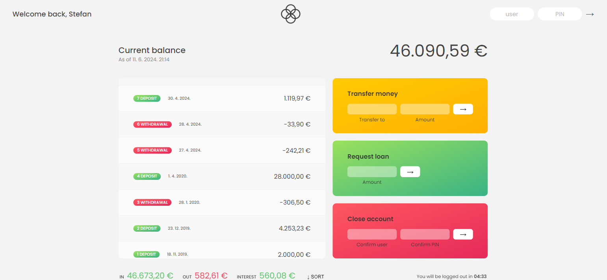

## About The Project

A banking app that supports:

- login
- transfers
- loan requests
- balance and transaction lists + sortings
- closing of the account

[Watch the video](https://raw.githubusercontent.com/cecibunkin/Bankist-App/main/assets/Bankist-video.mp4)

### Built With

- [JavaScript](https://developer.mozilla.org/en-US/docs/Web/JavaScript)
- [CSS](https://developer.mozilla.org/en-US/docs/Web/CSS)
- [HTML5](https://developer.mozilla.org/en-US/docs/Web/HTML)

## Getting Started

To run an app locally, open file `index.html` in the default browser.

## Contact

[Stefan Stamenkovic](https://www.linkedin.com/in/stefan-stamenkovic-394943254/) - cecibunkin@gmail.com

Project Link: [https://github.com/cecibunkin/Omnifood](https://github.com/cecibunkin/Omnifood)
